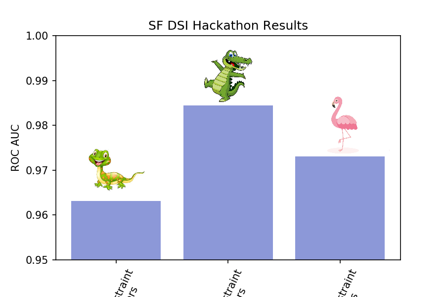

# Hackathon 1 - Predicting Income Levels

## Summary

### Overview

This hackathon is a team-based competition. The goal is to create the best performing model on a hold-out sample of data. 

This will be a constrained optimization. See the Project Management Venn Diagram, below.

The idea is that for any project one can have any two of these. One can have good work done cheap, but it will take a long time. One can have good work done fast, but it won't be cheap. Or one can have work done fast and on the cheap, but it won't be good.

For this hackaton, each will be given a dataset randomly assigned to one constraint: samples, features or algorithm.

To build a best model to predict whether an individual's wage level is above or below $50,000 based on the given dataset.

Three team were randomly assigned with specific constrains:

1. **Team Sample Constraint**: must use the cheap train sample, a smaller sample size
2. **Team Features Constraint**: limited to a maximum of 20 features
3. **Team Algorithm Constraint**: must use a Random Forest

Our Team, **Team Allegator** is assigned to the **Algorithm** constrain. The challenge is to build a best model to predict whether an individual's wage level is above or below $50,000 using **RANDOM FOREST** algorithm **ONLY**.

### Team Members and Primary Roles:
1. **Antony Paulson Chazhoor**: review RandomForest algorithms, draft code
2. **Eli Regen**: data EDA, cleaning, and feature creation, model QA/QC
3. **Kai Zhao**: study model hyperparameters through literature research and experiment, model debugging
4. **Kevin Roesch**: study model hyperparameters through literature research and experiment, model QA/QC

### Data
Descriptions of the data can be found [here](https://archive.ics.uci.edu/ml/datasets/adult). 

### Methodology
- Model: Random Forest + GridSearchCV
- Hyperparameters: based on the liberature research, our team narrow down the hyperparameters options to the following ones that we have insight about (due to the time constrain):
1. n_estimators: number of trees. Generally, more trees lead to better results but costy to run. We set our number of tree baseline based on the most powerful laptop in the group. The formula to estimate the baseline number of trees is: 
   **sqft(#rows * #columns) / # of CPUs##
2. min_sample_leaf: based on the literature research, we set number to be from 25 - 100.

### Results
Our team achieve the higest ROC AUC score. Detailed results of all team can be find in the following repo
[Repo for competition results](https://git.generalassemb.ly/DSI-US-8/SF-Flex-8/tree/master/hackathon_results)

### Discussion
The ROC AUC score of three teams are fairly close. This hackaton shows the advantage of data quality (more data and more features) outweights the advantage other teams have over us. However, random forest is more superior than many other algorithms. If the team is limited to use algorithms other than Random Forest (e.g., k-nearest neighbors, decision tree), the results could be different.

The team also have an interesting finding. Because the train data is unbalanced (i.e., class 1 : class 2 = 3 : 1), when we split the data using train/test split, we would normally apply the argument: 'stratify=y'. When we apply, GridSearch only uses 114 trees to find the best model. Without such argument, the best model needs the upper limit (500 models) to produce the best model. Becuase we are uncertain whether the testing data is as unbalanced as the training data, the team believe it would be benefitial to not use 'stratify=y' and use more trees to account for more randomness. This approach seems work well.

